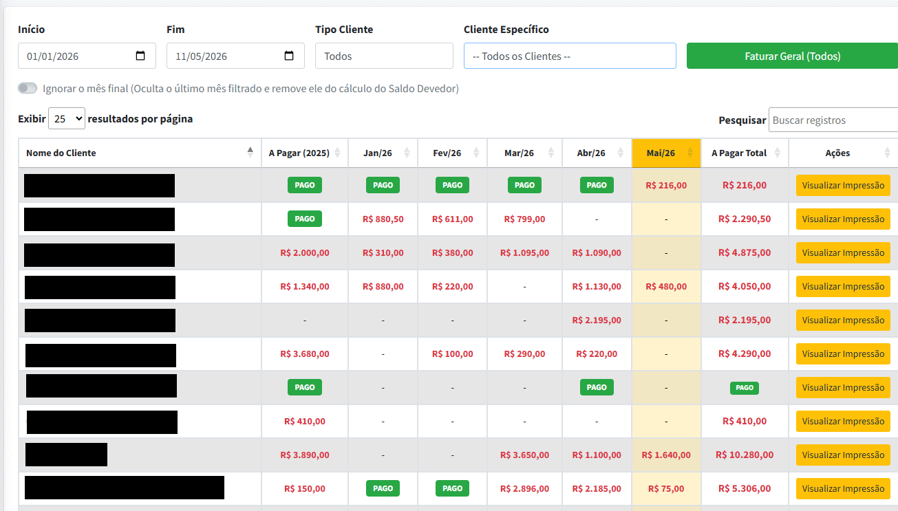
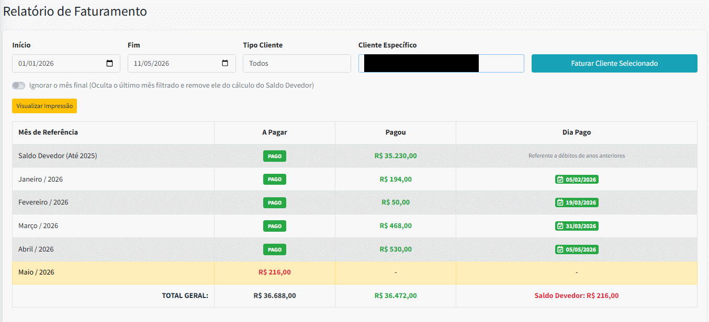
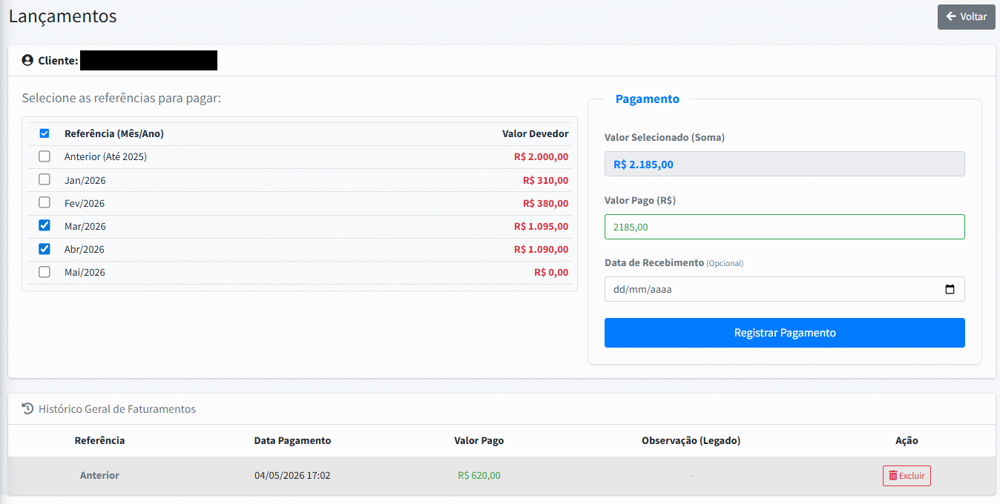
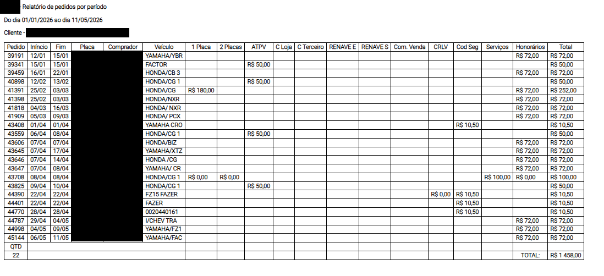

# Sistema de Gestão e Faturamento Automotivo

Plataforma web completa desenvolvida em PHP para o gerenciamento de serviços automotivos, controle financeiro de clientes e integração de dados. O sistema resolve problemas complexos de contabilidade de clientes, calculando saldos devedores históricos e abatendo pagamentos de forma assíncrona.

## 💻 Fluxo do Sistema e Telas

### 1. Painel de Controle (Dashboard Geral)
Visão consolidada de todos os clientes, mostrando meses faturados, status de pagamento (PAGO ou devedor) e filtros dinâmicos de data sem necessidade de reload da página (AJAX).

### 2. Visão Detalhada do Cliente
Painel individual que cruza os dados do que o cliente consumiu no mês com o que ele já pagou, gerando o saldo devedor exato por período e o saldo geral histórico.

### 3. Tela de Pagamento (Dar Baixa)
Formulário dinâmico que permite selecionar múltiplas faturas em aberto. O sistema soma os valores em tempo real via JavaScript e registra a baixa no banco de dados, vinculando o pagamento ao histórico.

### 4. Relatório Final de Serviços
Geração de relatório detalhado (layout para impressão/PDF) listando todos os serviços consumidos (Vistoria, Placas, Renave, Honorários) no período filtrado para envio ao cliente.

---

## 🛠️ Tecnologias e Ferramentas
* **Back-end:** PHP estruturado utilizando PDO para maior segurança nas consultas.
* **Banco de Dados:** MySQL/MariaDB com modelagem relacional (tabelas de clientes, pedidos, faturamentos e pagamentos).
* **Front-end:** HTML5, CSS3 (Bootstrap) e JavaScript (jQuery/DataTables).
* **Comunicação Assíncrona:** Uso intenso de AJAX para atualizar lógicas de fechamento em tempo real.

## ⚙️ Principais Desafios Resolvidos
* **Motor de Faturamento Complexo:** Desenvolvimento de lógica matemática no back-end para abater dívidas antigas e cruzar pagamentos parciais, evitando cobranças duplicadas.
* **Tabelas Dinâmicas de Inteligência:** Criação de colunas dinâmicas em PHP que se ocultam automaticamente caso todos os clientes do mês estejam com o saldo quitado.
